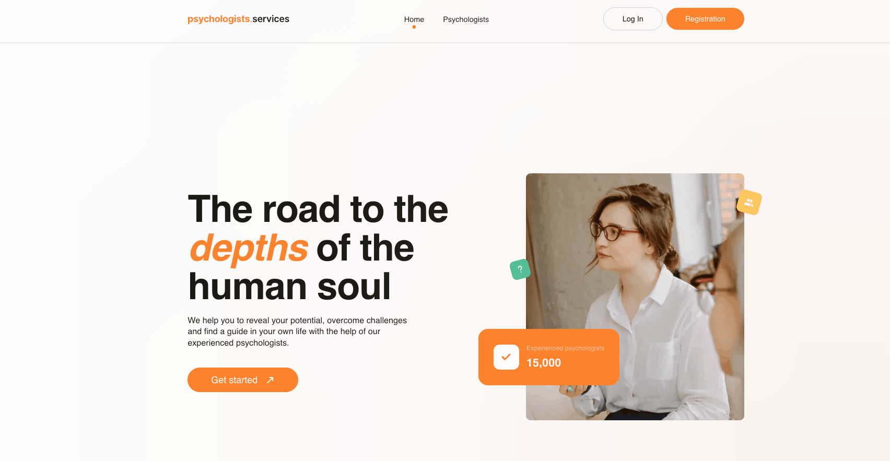

<a id="top"></a>

<div align="center">

# Psychologists.Services — Psychologist Services Web Application

### React & TypeScript application for finding psychologists, saving favorites, and requesting appointments.

<p align="center">
  
</p>

[Overview](#project-overview) •
[Features](#features) •
[Tech Stack](#️tech-stack) •
[Pages](#pages-structure) •
[Firebase](#firebase) •
[Design](#design) •
[Installation](#-nstallation--setup) •
[Author](#author)

</div>

---

## Project Overview

**Psychologists.Services** is a web application designed to make finding the right psychologist simple and convenient.

Users can explore psychologist profiles, compare specialists by name, price, and rating, read detailed information and client reviews, save preferred psychologists to a personal favorites list, and request an appointment with a selected specialist.

The application includes user authentication, persistent favorites, protected routes, form validation, and integration with Firebase Realtime Database.

---

## Features

🔹 **Psychologists Catalog:** Browse psychologist profiles with experience, specialization, license information, consultation details, hourly price, rating, and reviews.

🔹 **Smart Sorting:** Sort psychologists alphabetically (A–Z / Z–A), by price (low to high / high to low), or by rating (low to high / high to low).

🔹 **Favorites System:** Save preferred psychologists to a personal favorites list with Firebase persistence.

🔹 **Authentication:** Register, log in, log out, and restore the current user session using Firebase Authentication.

🔹 **Protected Favorites:** Access to the Favorites page is available only to authenticated users.

🔹 **Detailed Profiles:** Expand psychologist cards with **Read more** to view additional information and client reviews.

🔹 **Appointment Form:** Request a personal meeting with a selected psychologist and choose a preferred appointment time.

🔹 **Form Validation:** Forms are managed with React Hook Form and validated with Zod.

🔹 **Notifications:** React Hot Toast provides clear feedback for user actions and errors.

🔹 **Responsive UI:** Optimized for mobile, tablet, and desktop devices.

---

## Tech Stack

**Frontend:** React 19, TypeScript, Vite, CSS Modules  
**Routing:** React Router  
**State Management:** Zustand  
**Server State:** TanStack React Query  
**Backend & Authentication:** Firebase Authentication, Firebase Realtime Database  
**Forms & Validation:** React Hook Form, Zod  
**UI & UX:** React Select, React Datepicker, React Hot Toast  
**Tools:** ESLint, Prettier

---

## Pages Structure

🏠 `/` — **Home:** Landing page with an introduction to the service and a CTA leading to the psychologists catalog.

🧠 `/psychologists` — **Psychologists:** Main catalog with sorting, detailed psychologist profiles, reviews, favorites, and appointment requests.

❤️ `/favorites` — **Favorites:** Private page where authenticated users can view and manage their saved psychologists.

---

## Firebase

The application uses **Firebase** for authentication and persistent data storage.

**Firebase Authentication** handles user registration, login, logout, and authentication state.

**Firebase Realtime Database** stores psychologist information and users' favorite psychologist IDs, allowing favorites to persist between sessions and page reloads.

---

## Design

The project follows the provided [Figma design](https://www.figma.com/file/I5vjNb0NsJOpQRnRpMloSY/Psychologists.Services?type=design&node-id=0-1&mode=design&t=4zfT2zFANRbp1fCK-0).

---

## Installation & Setup

```bash
1. Clone the repository:

git clone https://github.com/IrynaYermak/Psychologists.Services.git
cd Psychologists.Services

2. Install dependencies:
npm install

3. Run the development server:
npm run dev

4. Create a production build:
npm run build
```

## Author

<div align="center">

Iryna Yermak — Frontend Developer

<br />

[⬆ Back to Top](#top)

</div>
